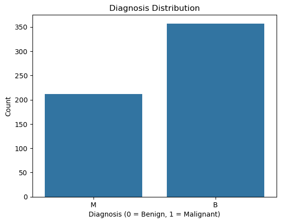
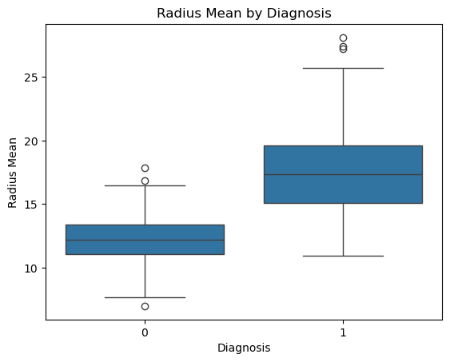
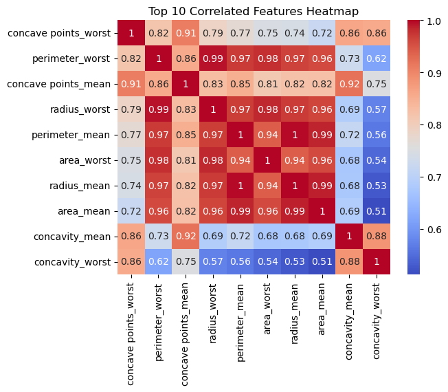
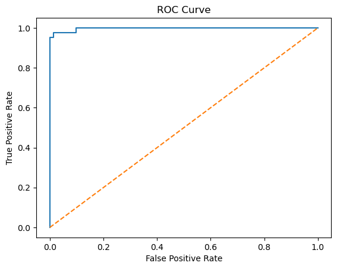

# Breast Cancer Prediction using Logistic Regression

This project builds a machine learning model using logistic regression to predict whether a tumor is benign or malignant based on features from the [Predicting Breast Cancer - Logistic Regression Data Set](https://www.kaggle.com/code/jagannathrk/predicting-breast-cancer-logistic-regression) available on Kaggle.

---

## Dataset

- Source: [Kaggle - Predicting Breast Cancer - Logistic Regression Data Set](https://www.kaggle.com/code/jagannathrk/predicting-breast-cancer-logistic-regression)
- Samples: 569
- Features: 30 numeric features describing cell nuclei characteristics
- Target: `diagnosis` — Malignant (`M`) or Benign (`B`)

---

## Project Workflow

### 1. Exploratory Data Analysis (EDA)
- Checked for null values and column types.
- Visualized class distribution:

  

- Visualized mean radius by diagnosis:

  

- Correlation analysis to identify top predictive features:

  

### 2. Data Preprocessing
- Dropped the `id` column.
- Separated features and target.
- Train-test split (80/20).
- Standardized features using `StandardScaler`.

### 3. Modeling
- Built a Logistic Regression model using scikit-learn.
- Trained on the training set, predicted on the test set.

### 4. Evaluation
- **Accuracy:** 97.37%
- Precision, Recall, F1-score reported using `classification_report`.
- Confusion matrix plotted to analyze performance.
- ROC Curve with AUC score:

  
---

## Technologies Used

- Python
- Jupyter Notebook
- Pandas, NumPy
- Seaborn, Matplotlib
- Scikit-learn

---

## Results

- Logistic Regression achieved **97.37% accuracy** on the test data.
- Very low number of false positives and false negatives.
- The model performs well for both malignant and benign classification.

---

## License

This project is for educational purposes only.
